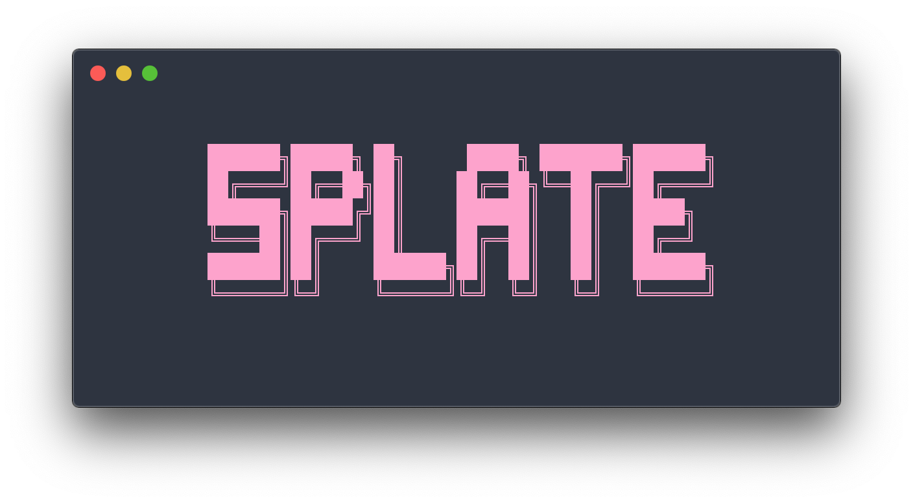

# Splate



**Splate** is an **S**CSS boiler**plate** (*S+plate*) for use in styling frontend web development projects. It’s based on the [7-1](https://sass-guidelin.es/) SCSS format. Splate keeps your styles neat and tidy, and provides leeway for adding your own custom rules, with easy compiling and documentation creation.

## Version 2.0.0

Splate now uses `sass` ([Dart SASS](https://www.npmjs.com/package/sass)) for compiling SCSS, replacing the [now deprecated](https://sass-lang.com/blog/libsass-is-deprecated) `node-sass`.

## What is ‘SCSS’?

[SCSS](https://sass-lang.com/documentation/syntax) (Sassy CSS) is a syntax style for SASS (Syntactically Awesome Style Sheets), which is itself an extension language for CSS. What does any of that mean? Webpages and web-based projects are styled with CSS, and while much can be achieved with default CSS, SCSS allows for more dynamic stylesheets that are easier to maintain, and add deeper programmatic functionality with utilities like variables, modules, nesting, and functions.

One of SCSS’s best features is the ability to separate styles into [_partials_](https://sass-lang.com/guide#topic-4#), allowing you to organize your styles into a more modular filetree that’s easier to work with. The partials contain small, modular bits of SCSS, which are imported into a main SCSS file before compiling. Splate is a pre-made directory structure for just such a use case.


## Usage

To use Splate in your project, clone the repo, write your preferred styles in the `src/scss/` files. You can choose to just compile the SCSS into CSS, preserve your SCSS files too, and/or integrate everything with any kind of HTML file structure into a finished `dist/` directory.

### Clone Splate locally, and install dependencies

Splate uses [`sass`](https://www.npmjs.com/package/sass) (Dart SASS) for compiling, [`copyfiles`](https://www.npmjs.com/package/copyfiles) for cross-platform file copying, and [`sassdoc`](https://www.npmjs.com/package/sassdoc) for creating a complete documentation site for your SCSS.

```sh
git clone https://github.com/timmybytes/splate.git
cd splate
npm install
```

### Compile SCSS into CSS

Compiled CSS goes in the `dist/` directory be default.

```sh
npm run scss
```

### Compile SCSS live and watch for changes

```sh
npm run scss:watch
```

### Copy all SCSS and HTML files from `src/` to `dist/`

```sh
npm run build
```

### Generate SassDoc documentation

Outputs to `sassdoc/` in root by default. [See below](##SassDoc) for further instructions.

```sh
npm run doc
```

### Create complete `dist/` files and SCSS documentation

Finds and copies all HTML files and SCSS (and preserves their directory structures) to `dist/`, compiles all SCSS into single css file in `dist/css/main.css`, and creates/updates `sassdoc/` simultaneously, either overwriting previous content or creating directories/files as needed.

```sh
npm run prod
```

This will leave you with a finished, distributable directory for your project.

<!--
### Deploy to GitHub Pages

Optionally, you can use Splate to build an entire site and deploy it to GitHub Pages.
-->

## SassDoc

Splate uses [SassDoc](http://sassdoc.com/) for creating optional SCSS documentation.

The `sassdoc/` directory contains very basic initial documentation for the project. SassDoc will overwrite the `sassdoc/` directory each time it's generated and you can view or deploy the included html file for reference.

<!--
### Optional Deployment

If you'd like to deploy your SassDoc site live, you can use `sassdocify` to deploy to GitHub Pages.
-->

## Contributing

I’m not currently looking for contributions to Splate. However, if you feel something could be improved, feel free to submit an issue for discussion. Any and all ideas will be considered!

## License

This project is licensed under the [MIT License](./LICENSE.md). Splate is just a bunch of files—fork, tweak, and destroy them as you see fit.
